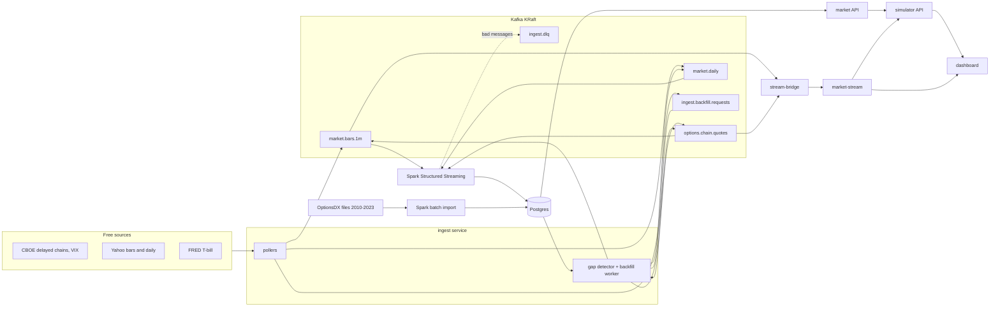

# Quantisti: SPX Options Trading Simulator

Quantisti prices, backtests and paper-trades **S&P 500 index (SPX) options** strategies, using real market data
that a Kafka + Spark pipeline collects from free sources. It is a set of Python microservices with a Next.js
trading dashboard and a marketing site.

SPX options are European, cash-settled, x100, on 5-point strikes, and expire every weekday on the NYSE calendar.

---

## What it does

- **Option chains for any day since 2010.** Real end-of-day quotes for 2010-2023 (OptionsDX) and from October 2026
  (CBOE, collected live). The years in between are priced with Black-Scholes from VIX, a skewed volatility smile and
  the FRED T-bill rate. Implied volatility and Greeks are recomputed from mid prices against a forward implied by
  put-call parity, since vendor IVs are often inconsistent.
- **Backtests** of strategy templates (iron condors, spreads, straddles, strangles, calendars...): enter at the close,
  price every leg from that day's chain, settle at the expiry close, and report P&L, win rate, drawdown and Sharpe/Sortino.
- **Live strategies and paper trading** from ~15-minute-delayed SPX chains, marked to market as quotes arrive.
  The dashboard shows payoff charts, the option chain and a "Delayed 15 min" badge.
- **A streaming data pipeline** that keeps all of this current: intraday bars, option chains and daily data flow
  through Kafka into Postgres via Spark, and a gap detector finds and refills missing sessions.

## Architecture



| Service | Port | What it does |
|---|---|---|
| `market` | 8081 | SPX daily and intraday data, VIX, option chains with IV and Greeks, expiry calendar |
| `simulator` | 8082 | strategy templates, backtests, live strategies, paper trading |
| `market-stream` | 8090 | latest quotes in memory, REST and WebSocket |
| `ingest` | 8088 | pollers, gap detector, backfill worker ([README](services/ingest/README.md)) |
| `stream-bridge` | | Kafka -> market-stream |
| `spark` | 4040 (UI) | Kafka -> Postgres streaming job, OptionsDX batch import ([README](services/stream-processing/README.md)) |
| `ml` | 8085 | weekly feature engineering (technical, volatility, VIX); no model yet |
| `strategy-dashboard` | 3000 | Next.js 14 trading dashboard |
| `landing` | 3000 | Next.js 15 marketing site |
| gateway, portfolio, stats, explain | 8080, 8083, 8084, 8086 | health-check stubs |

Kafka UI runs on 8089.

## Data coverage

| Data | Source | Coverage |
|---|---|---|
| SPX / VIX / 3-month T-bill, daily | Yahoo, CBOE, FRED | 2010 to today |
| SPX / VIX intraday | Yahoo, ~15 min delayed | 1m from ~30 days back, 5m 60 days, 1h ~2 years, then collected continuously |
| SPX option chains | OptionsDX (free files) | 2010-2023 end of day, no open interest, 43 sessions missing |
| SPX option chains | CBOE delayed quotes | from 2026-10-01, every 90 s in market hours plus the close, with open interest |
| SPX option chains | none free | 2024 to Sep 2026: synthetic (Black-Scholes from VIX) |

Missing data is reported, never invented: the gap detector marks what no free source can supply as `unrecoverable`.

## Quick start

```bash
docker compose up -d --wait postgres
# apply schema/sql/*.sql, load daily history, then:
docker compose -f docker-compose.yml -f docker-compose.streaming.yml up -d --build
```

The full sequence, including loading data and the dashboard, is in [docs/getting-started.md](docs/getting-started.md).

## Tech stack

**Backend:** Python 3.11, FastAPI, psycopg2, exchange_calendars, SciPy · **Data:** PostgreSQL 16, Apache Kafka 3.9 (KRaft),
Spark 3.5 Structured Streaming, confluent-kafka, yfinance · **Frontend:** Next.js, React, Recharts · **Tooling:** Docker Compose, pytest

## Planned

Not built yet: an ML prediction endpoint (the dashboard's weekly range forecast is still sample data), SHAP
explanations, the portfolio and stats services, authentication through the gateway, blocking CI, and cloud
deployment. `docs/architecture.md` describes that target design.
